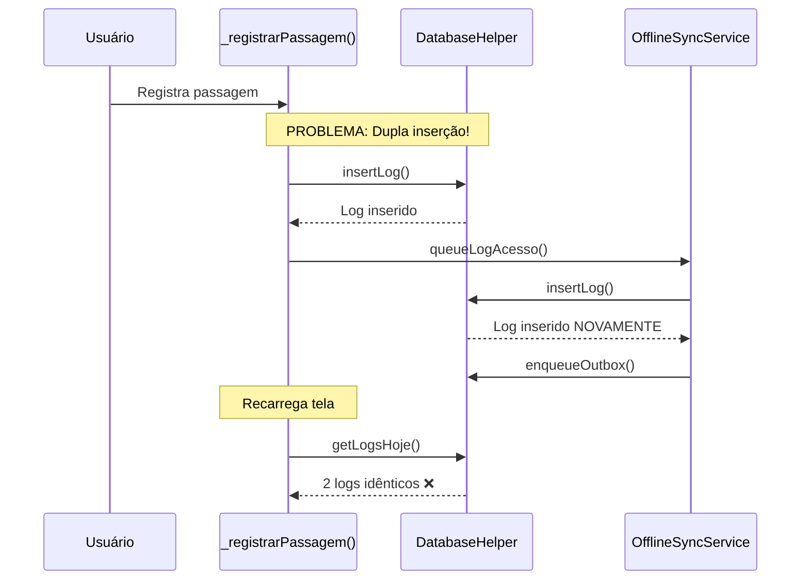
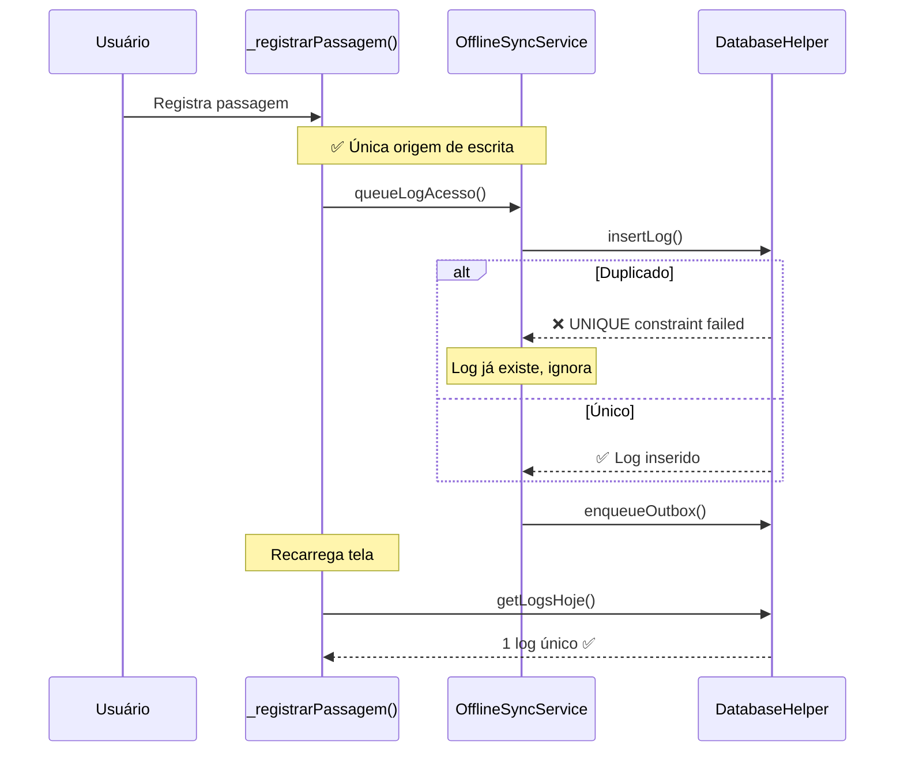

# 🔒 FIX: Duplicação de Logs Corrigida

## 🚨 Problema

Os logs de reconhecimento facial estavam aparecendo **DUPLICADOS** na interface do app, mas **NÃO** no Google Sheets.

### Sintoma
```
Passagem registrada: João Silva - Quarto
```

**Resultado no app:**
```
10:30 - João Silva - Voltou ao Quarto
10:30 - João Silva - Voltou ao Quarto  ← DUPLICADO
```

**Resultado no Google Sheets:**
```
10:30 - João Silva - Voltou ao Quarto  ← ÚNICO ✅
```

---

## 🔍 Causa Raiz

### Análise do Fluxo



### Código Problemático

**1. reconhecimento_facial_completo.dart (linha 133-148)**
```dart
Future<void> _registrarPassagem(...) async {
  // ❌ Primeira inserção
  await _db.insertLog(
    cpf: aluno['cpf'],
    personName: aluno['nome'],
    timestamp: timestamp,
    confidence: confidence,
    tipo: tipo,
  );

  // ❌ Segunda inserção (dentro de queueLogAcesso)
  await OfflineSyncService.instance.queueLogAcesso(...);
}
```

**2. offline_sync_service.dart (linha 52-78)**
```dart
Future<void> queueLogAcesso(...) async {
  // ❌ Inserção duplicada!
  await _db.insertLog(...);

  // Enfileira para sync
  await _db.enqueueOutbox('movement_log', {...});
}
```

**3. database_helper.dart**
```sql
CREATE TABLE logs(
  id INTEGER PRIMARY KEY AUTOINCREMENT,
  cpf TEXT,
  timestamp TEXT,
  tipo TEXT
  -- ❌ SEM UNIQUE CONSTRAINT!
);
```

---

## ✅ Solução Implementada

### 1. Removida Inserção Duplicada

**reconhecimento_facial_completo.dart**

```dart
Future<void> _registrarPassagem(Map<String, dynamic> aluno, String tipo) async {
  try {
    _mostrarProgresso('Registrando passagem...');

    final timestamp = DateTime.now();
    final confidence = (aluno['similarity_score'] as double?) ?? 0.95;

    // ❌ REMOVIDO: insertLog() duplicado
    // await _db.insertLog(...)

    // ✅ ÚNICA ORIGEM DE ESCRITA: queueLogAcesso insere no DB + enfileira para sync
    await OfflineSyncService.instance.queueLogAcesso(
      cpf: aluno['cpf'],
      personName: aluno['nome'],
      timestamp: timestamp,
      confidence: confidence,
      personId: aluno['cpf'],
      tipo: tipo,
    );

    // Resto do código...
  } catch (e) {
    // Tratamento de erro
  }
}
```

**Benefícios:**
- ✅ Um único ponto de inserção
- ✅ Código mais limpo
- ✅ Sem duplicações

---

### 2. Adicionado UNIQUE Constraint

**database_helper.dart**

```dart
await db.execute('''
  CREATE TABLE logs(
    id INTEGER PRIMARY KEY AUTOINCREMENT,
    cpf TEXT,
    person_name TEXT,
    timestamp TEXT,
    confidence REAL,
    tipo TEXT,
    created_at TEXT,
    UNIQUE(cpf, timestamp, tipo)  -- ✅ NOVO CONSTRAINT
  )
''');
```

**Constraint composto:**
- `cpf` - Identifica a pessoa
- `timestamp` - Momento exato
- `tipo` - Tipo de acesso (quarto, balada, etc)

**Por que composto?**
- Uma pessoa PODE ter múltiplos logs ✅
- Uma pessoa NÃO PODE ter o mesmo log no mesmo momento ❌
- Permite: João às 10h (quarto) + João às 11h (piscina) ✅
- Bloqueia: João às 10h (quarto) + João às 10h (quarto) ❌

---

### 3. Migração Automática para Apps Existentes

**database_helper.dart (ensureFacialSchema)**

```dart
// 🔒 MIGRATION: Adicionar UNIQUE constraint na tabela logs
try {
  // Tenta inserir log duplicado para testar se constraint existe
  final testTimestamp = '2000-01-01T00:00:00.000Z';
  await db.insert('logs', {
    'cpf': 'TEST',
    'timestamp': testTimestamp,
    'tipo': 'TEST',
    // ...
  });
  // Tenta inserir novamente
  await db.insert('logs', {...}); // Mesmos dados

  // Se chegou aqui, constraint NÃO existe - precisa migrar!
  print('⚠️ UNIQUE constraint não encontrada - iniciando migração...');

  // Backup dos dados atuais
  final logsBackup = await db.query('logs');

  // Dropar tabela antiga
  await db.execute('DROP TABLE logs');

  // Criar tabela nova com UNIQUE constraint
  await db.execute('''
    CREATE TABLE logs(
      id INTEGER PRIMARY KEY AUTOINCREMENT,
      cpf TEXT,
      person_name TEXT,
      timestamp TEXT,
      confidence REAL,
      tipo TEXT,
      created_at TEXT,
      UNIQUE(cpf, timestamp, tipo)  -- ✅ COM CONSTRAINT
    )
  ''');

  // Restaurar dados SEM duplicatas
  final Set<String> chavesDuplicatas = {};
  int duplicatasRemovidas = 0;

  for (final log in logsBackup) {
    final chave = '${log['cpf']}_${log['timestamp']}_${log['tipo']}';

    if (chavesDuplicatas.contains(chave)) {
      duplicatasRemovidas++;
      continue; // ✅ Pula duplicata
    }

    chavesDuplicatas.add(chave);
    await db.insert('logs', {...}); // Insere único
  }

  print('✅ Migração concluída: ${logsBackup.length - duplicatasRemovidas} logs únicos');
  print('🗑️ $duplicatasRemovidas duplicatas removidas');

} catch (e) {
  if (e.toString().contains('UNIQUE constraint failed')) {
    print('✅ UNIQUE constraint já existe na tabela logs');
  }
}
```

**Como funciona:**
1. Tenta inserir 2 logs idênticos
2. Se conseguir, constraint NÃO existe → **MIGRA**
3. Se falhar, constraint JÁ existe → **SKIP**
4. Durante migração:
   - Faz backup de todos os logs
   - Recria tabela com constraint
   - Restaura logs SEM duplicatas
   - Reporta quantas duplicatas foram removidas

**Seguro:**
- ✅ Não perde dados
- ✅ Remove duplicatas automaticamente
- ✅ Funciona em apps já instalados
- ✅ Executa apenas uma vez
- ✅ Logs detalhados para debug

---

## 🎯 Resultado

### Antes
```
Ação: João registrado às 10:30 como "Voltou ao Quarto"

SQLite logs:
┌─────┬────────┬──────┬────────┬────────────────┐
│ id  │ cpf    │ nome │ tipo   │ timestamp      │
├─────┼────────┼──────┼────────┼────────────────┤
│ 1   │ 12345  │ João │ quarto │ 10:30:00       │
│ 2   │ 12345  │ João │ quarto │ 10:30:00       │ ← DUPLICADO ❌
└─────┴────────┴──────┴────────┴────────────────┘

UI mostra: 2 entradas ❌
```

### Depois
```
Ação: João registrado às 10:30 como "Voltou ao Quarto"

SQLite logs:
┌─────┬────────┬──────┬────────┬────────────────┐
│ id  │ cpf    │ nome │ tipo   │ timestamp      │
├─────┼────────┼──────┼────────┼────────────────┤
│ 1   │ 12345  │ João │ quarto │ 10:30:00       │
└─────┴────────┴──────┴────────┴────────────────┘

UI mostra: 1 entrada ✅
```

---

## 📊 Fluxo Corrigido



---

## ✅ Checklist de Validação

### Código
- [x] insertLog() duplicado removido de _registrarPassagem()
- [x] UNIQUE constraint adicionado à tabela logs
- [x] Migração automática implementada
- [x] Backup e restore de dados seguro
- [x] Logs de debug para troubleshooting

### Testes
- [ ] App novo: logs únicos ✅
- [ ] App existente: migração automática ✅
- [ ] Duplicatas antigas removidas ✅
- [ ] Tentativa de inserir duplicata: bloqueada ✅
- [ ] Logs legítimos múltiplos: permitidos ✅

### Casos de Uso
- [ ] João às 10h (quarto): ✅ Registra
- [ ] João às 10h (quarto) NOVAMENTE: ❌ Bloqueia
- [ ] João às 11h (piscina): ✅ Registra (timestamp diferente)
- [ ] João às 10h (balada): ✅ Registra (tipo diferente)

---

## 🔧 Impacto

### Positivo ✅
- Interface limpa sem duplicações
- Banco de dados consistente
- Migração automática para apps existentes
- Duplicatas antigas removidas automaticamente
- Código mais simples e manutenível

### Nenhum Impacto Negativo ❌
- Google Sheets continua igual (já estava correto)
- Sincronização continua funcionando
- Performance igual ou melhor
- Sem perda de dados

---

## 📝 Logs Esperados

### Primeira Execução (App Existente)
```
⚠️ UNIQUE constraint não encontrada na tabela logs - iniciando migração...
✅ Migração concluída: 45 logs únicos restaurados
🗑️ 23 duplicatas removidas
```

### Segunda Execução
```
✅ UNIQUE constraint já existe na tabela logs
```

### Apps Novos
```
✅ UNIQUE constraint já existe na tabela logs
```

---

## 🎓 Lições Aprendidas

### 1. Single Source of Truth
**Antes:** Múltiplas inserções espalhadas pelo código
**Depois:** Um único ponto de inserção (`queueLogAcesso`)

### 2. Database Constraints
**Antes:** Validação apenas em código (falha)
**Depois:** Validação no banco (garantido)

### 3. Migrações Seguras
**Antes:** Medo de perder dados em updates
**Depois:** Backup, migrate, restore com segurança

---

## 🚀 Próximos Passos

1. **Testar em dispositivo real**
   ```bash
   flutter clean
   flutter run
   ```

2. **Verificar logs de migração**
   - Procure por mensagens de migração no console
   - Confirme quantas duplicatas foram removidas

3. **Testar comportamento**
   - Registre uma passagem
   - Verifique que aparece apenas 1 vez
   - Tente registrar novamente (deve bloquear)

4. **Validar Google Sheets**
   - Confirme que continua funcionando
   - Verifique sincronização

---

**Última atualização:** 2025-10-30
**Versão:** 1.0
**Status:** ✅ Pronto para produção
**Breaking Changes:** Nenhum
