# 🗺️ FLUXOGRAMA COMPLETO DO SISTEMA ELLUS

## 📑 Índice
1. [Arquitetura Geral](#1-arquitetura-geral)
2. [Banco de Dados SQLite](#2-banco-de-dados-sqlite)
3. [Conexões com Google Sheets](#3-conexões-com-google-sheets)
4. [Mapa de Navegação](#4-mapa-de-navegação)
5. [Fluxo de Autenticação](#5-fluxo-de-autenticação)
6. [Fluxo de Embarque](#6-fluxo-de-embarque)
7. [Fluxo de Reconhecimento Facial](#7-fluxo-de-reconhecimento-facial)
8. [Fluxo de Cadastro Facial](#8-fluxo-de-cadastro-facial)
9. [Fluxo de Sincronização](#9-fluxo-de-sincronização)
10. [Serviços e suas Funções](#10-serviços-e-suas-funções)

---

## 1. ARQUITETURA GERAL

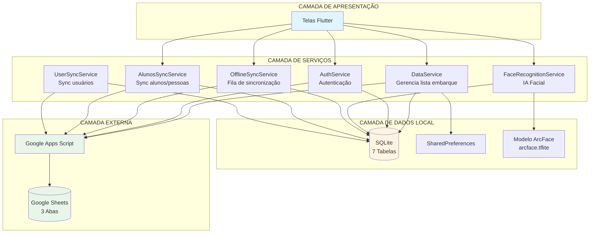

---

## 2. BANCO DE DADOS SQLite

### 2.1 Diagrama de Tabelas

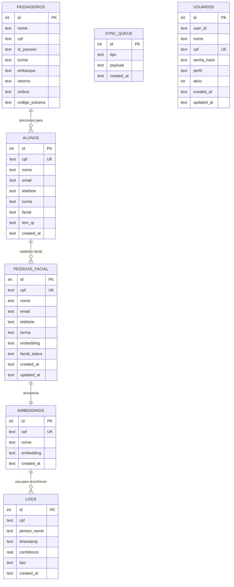

### 2.2 Descrição das Tabelas

| Tabela | Propósito | Origem | Ciclo de Vida |
|--------|-----------|--------|---------------|
| **passageiros** | Lista temporária de embarque do passeio atual | Google Sheets (aba Embarque) | Limpa ao trocar passeio |
| **alunos** | Alunos que possuem QR/pulseira cadastrada | Copiado de passageiros + Sync da aba Alunos | Persiste entre passeios |
| **pessoas_facial** | **NOVO** Banco permanente de pessoas com facial | Aba Pessoas do Google Sheets | Permanente |
| **embeddings** | Cache de embeddings para reconhecimento rápido | Gerado localmente + Sync da aba Pessoas | Persiste |
| **logs** | Histórico de reconhecimentos faciais | Gerado localmente | Persiste |
| **sync_queue** | Fila de sincronização offline | Gerado localmente | Limpa após sync |
| **usuarios** | Usuários do sistema (login) | Aba Usuários do Google Sheets | Permanente |

---

## 3. CONEXÕES COM GOOGLE SHEETS

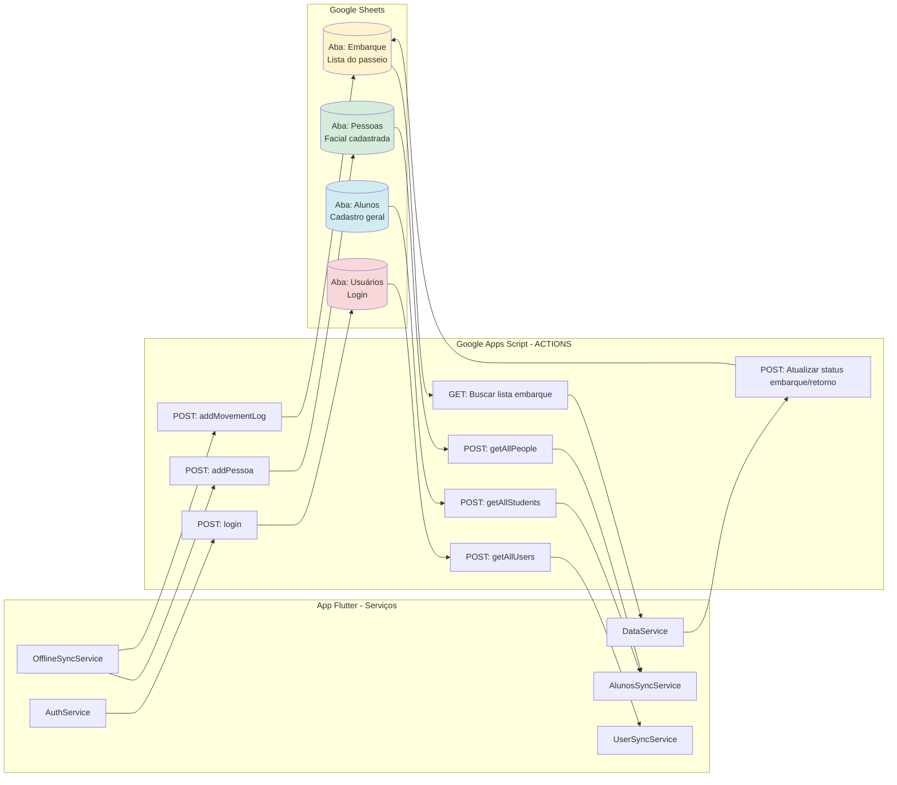

### 3.1 Detalhamento das Actions

| Action | Método | Parâmetros | Retorno | Aba Destino |
|--------|--------|------------|---------|-------------|
| **GET (url params)** | GET | `?colegio=X&id_passeio=Y&onibus=Z` | Lista de passageiros | Embarque |
| **updateEmbarque** | POST | `cpf, tipo, timestamp` | Status | Embarque |
| **getAllStudents** | POST | `action: 'getAllStudents'` | Lista de alunos | Alunos |
| **getAllPeople** | POST | `action: 'getAllPeople'` | Lista de pessoas + embeddings | Pessoas |
| **addPessoa** | POST | `cpf, nome, email, telefone, embedding` | Success | Pessoas |
| **getAllUsers** | POST | `action: 'getAllUsers'` | Lista de usuários | Usuários |
| **login** | POST | `cpf, senha` | User data + token | Usuários |
| **addMovementLog** | POST | `people: [{cpf, timestamp, tipo}]` | Success | Embarque (Logs) |

---

## 4. MAPA DE NAVEGAÇÃO

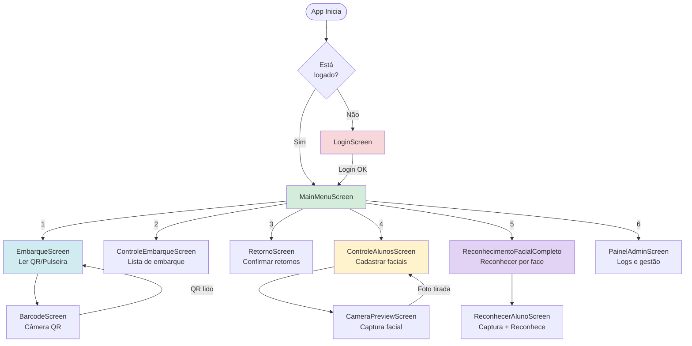

---

## 5. FLUXO DE AUTENTICAÇÃO

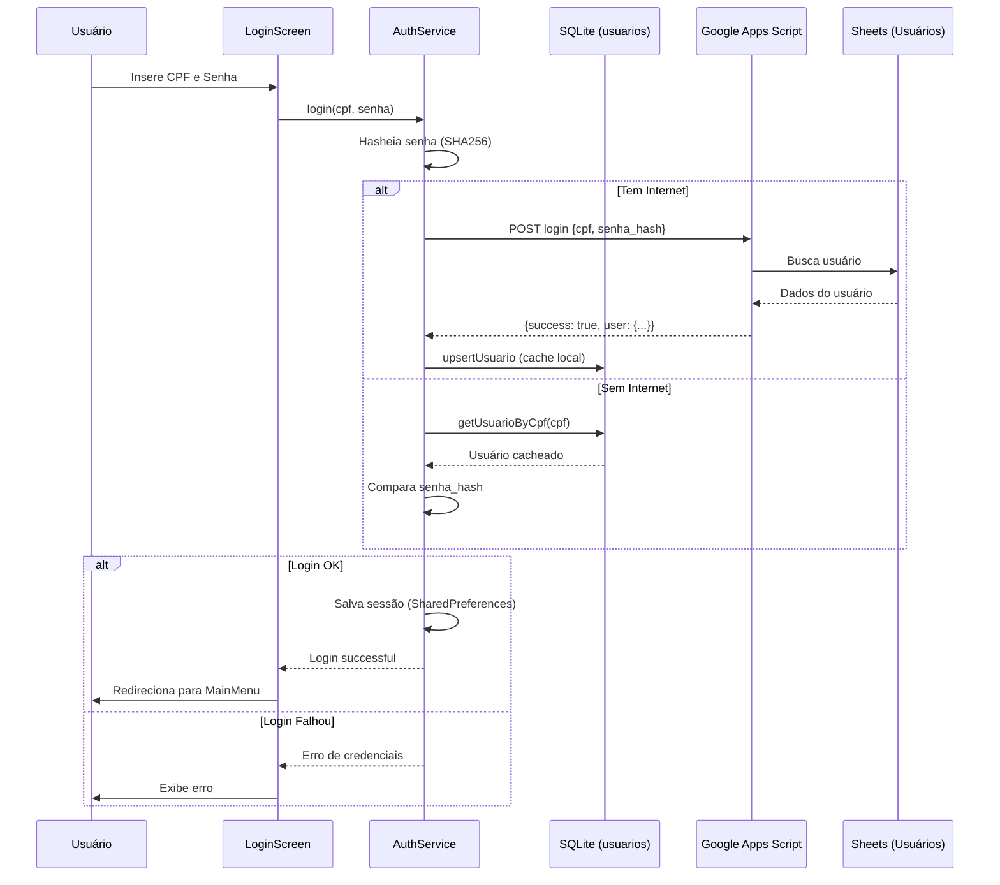

---

## 6. FLUXO DE EMBARQUE

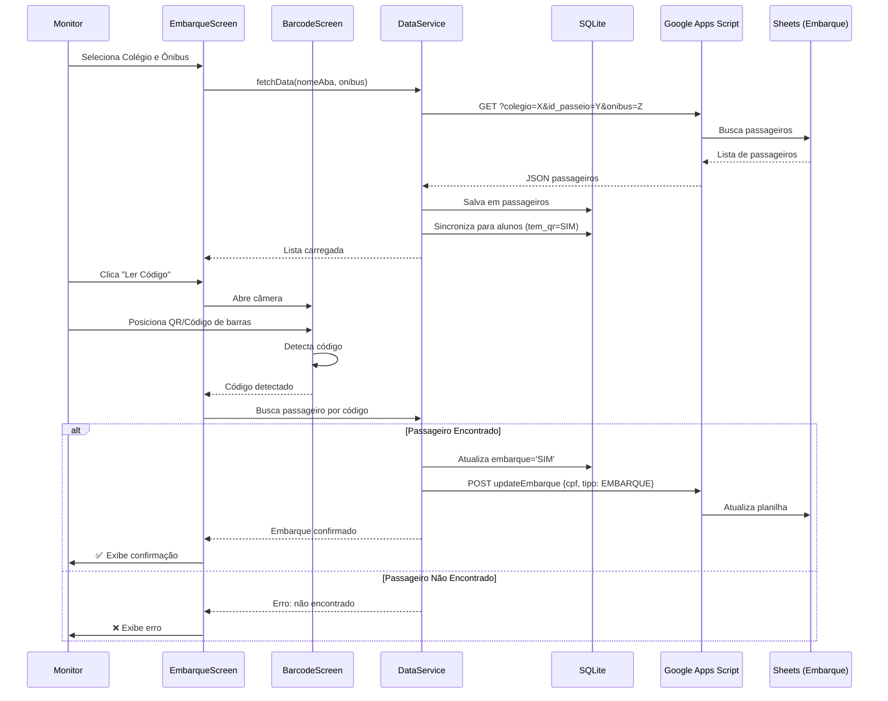

---

## 7. FLUXO DE RECONHECIMENTO FACIAL

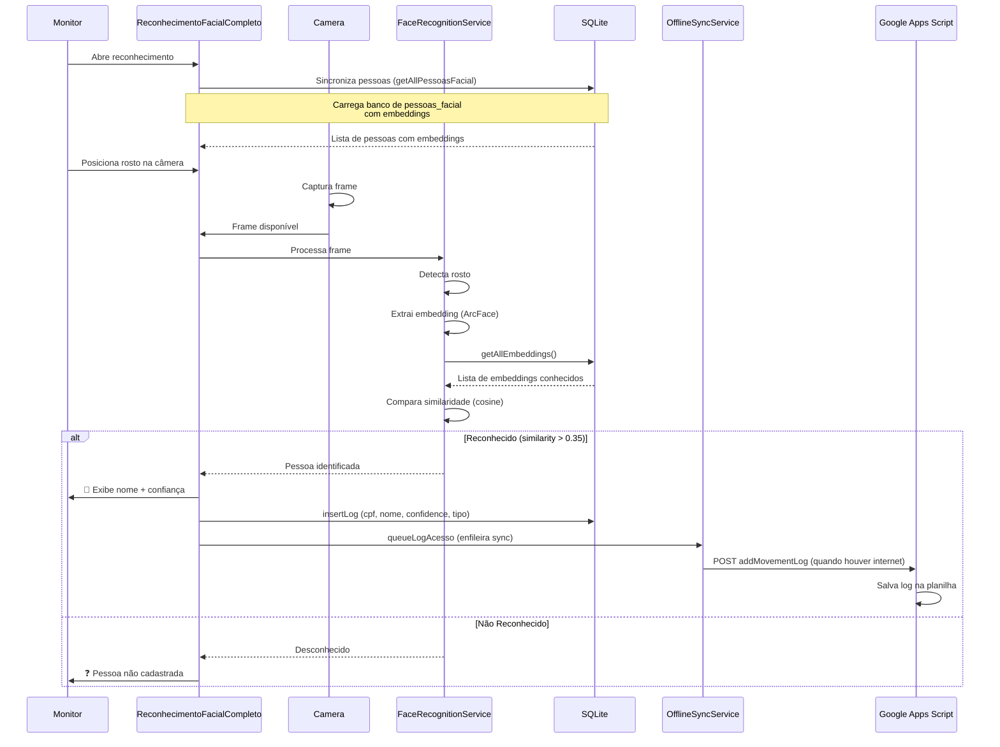

---

## 8. FLUXO DE CADASTRO FACIAL

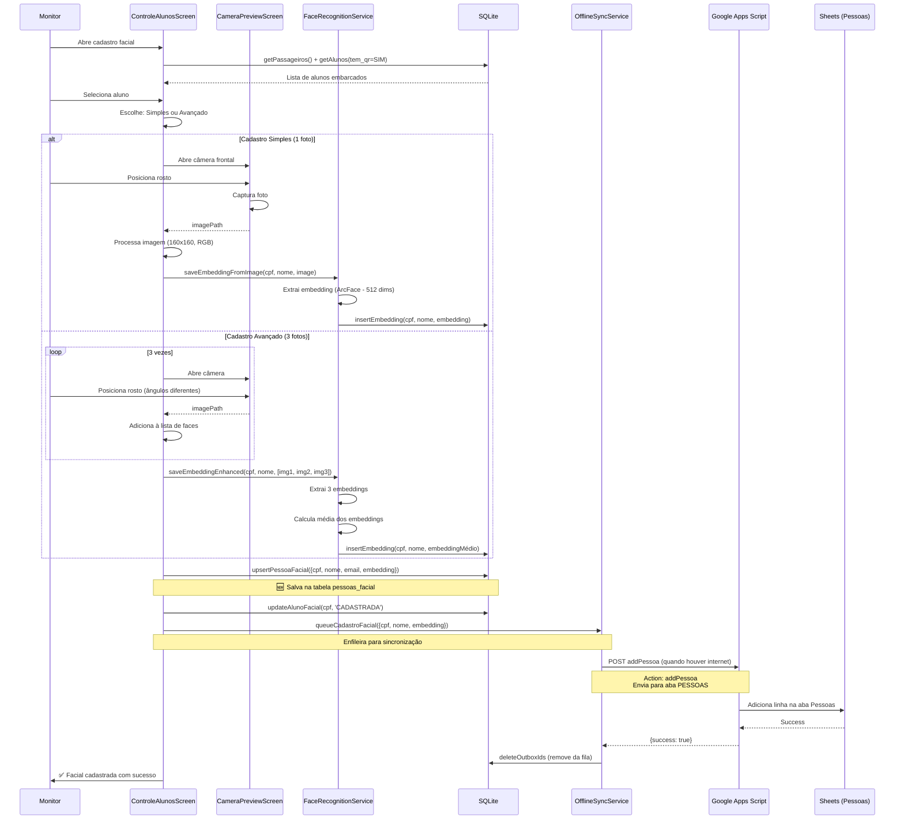

---

## 9. FLUXO DE SINCRONIZAÇÃO

### 9.1 Sincronização Automática (Timer)

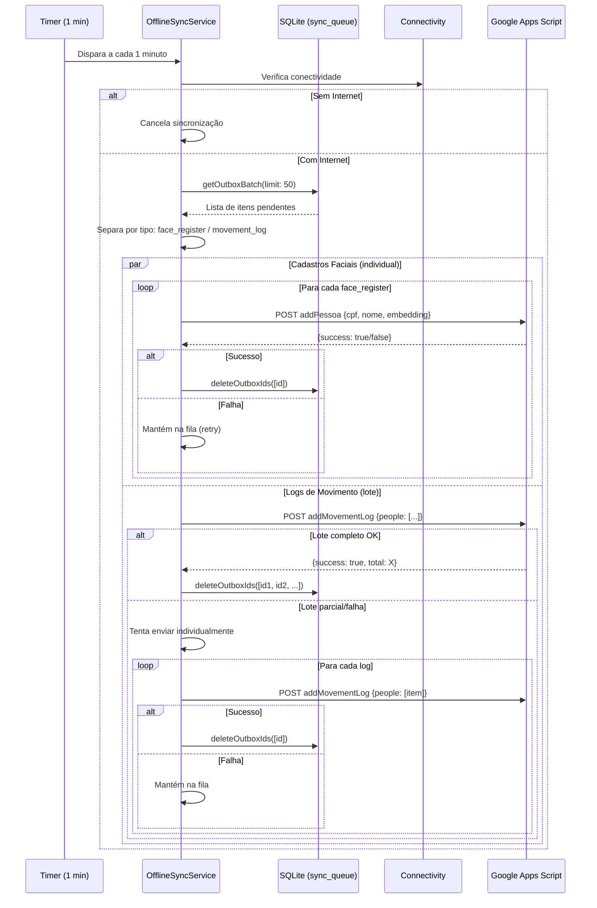

### 9.2 Sincronização de Pessoas (Download)

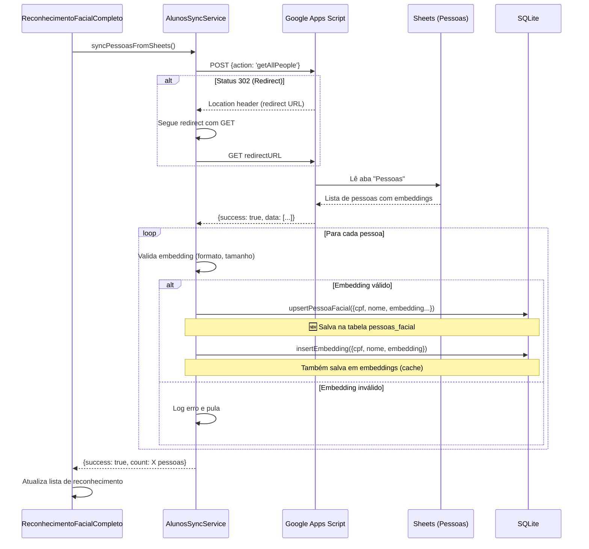

---

## 10. SERVIÇOS E SUAS FUNÇÕES

### 10.1 DataService

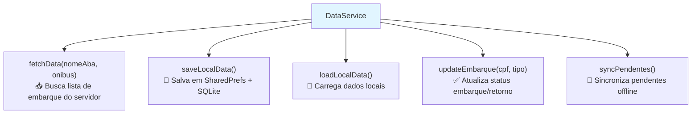

**Responsabilidades:**
- Gerenciar lista de passageiros do embarque atual
- Comunicação com Google Sheets (aba Embarque)
- Atualização de status de embarque/retorno
- Cache local (SharedPreferences + SQLite tabela passageiros)
- Sincronização de pendentes quando volta online

---

### 10.2 AuthService

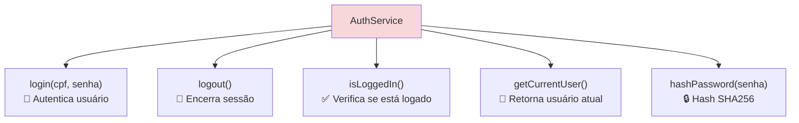

**Responsabilidades:**
- Autenticação online (Google Sheets) e offline (SQLite)
- Gerenciamento de sessão (SharedPreferences)
- Hash de senhas (SHA256)
- Cache de usuários localmente (tabela usuarios)

---

### 10.3 FaceRecognitionService

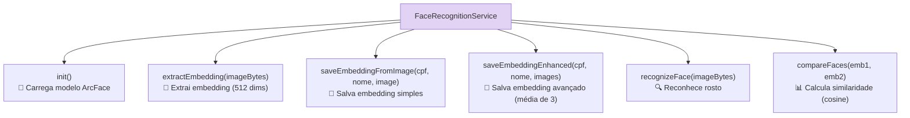

**Responsabilidades:**
- Carregar e gerenciar modelo TensorFlow Lite (ArcFace)
- Extração de embeddings faciais (512 dimensões)
- Reconhecimento facial por similaridade (cosine similarity)
- Cadastro simples (1 foto) e avançado (3 fotos com média)
- Threshold de reconhecimento: 0.35 (35%)

---

### 10.4 OfflineSyncService

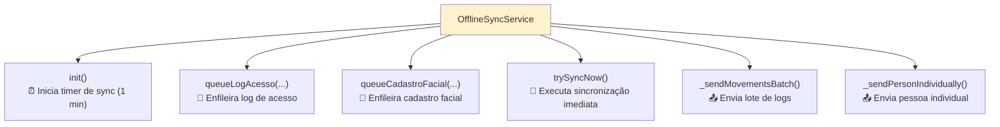

**Responsabilidades:**
- Fila de sincronização offline (tabela sync_queue)
- Timer automático de sincronização (1 minuto)
- Envio de logs de movimento (lote + fallback individual)
- Envio de cadastros faciais (sempre individual)
- Tolerância a 301/302 do Google Apps Script
- Retry automático com backoff

**IMPORTANTE:**
- Cadastros faciais vão para aba "Pessoas" (action: `addPessoa`)
- Logs de movimento vão para aba "Embarque" (action: `addMovementLog`)

---

### 10.5 AlunosSyncService

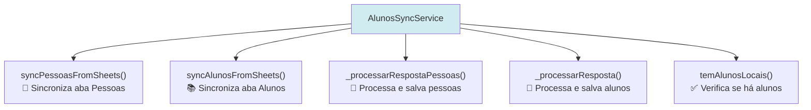

**Responsabilidades:**
- Sincronizar aba "Pessoas" → tabela `pessoas_facial` (com embeddings)
- Sincronizar aba "Alunos" → tabela `alunos` (sem embeddings)
- Validação de embeddings (formato, tamanho, tipo)
- Tratamento de redirects 302 do Google Apps Script
- Parse de embeddings (string JSON → List<double>)

**Diferença entre Pessoas e Alunos:**
- **Pessoas**: Tem facial cadastrada, salva em `pessoas_facial` com embedding
- **Alunos**: Cadastro geral, pode ou não ter facial, salva em `alunos`

---

### 10.6 UserSyncService

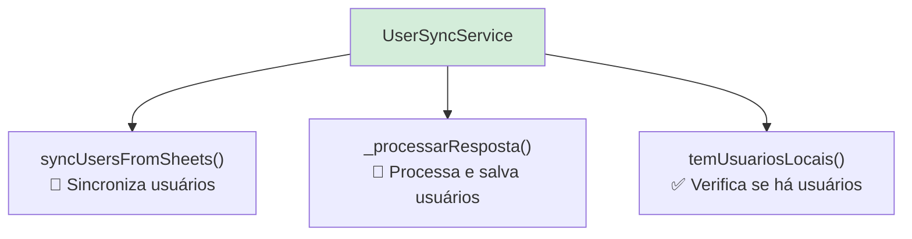

**Responsabilidades:**
- Sincronizar aba "Usuários" → tabela `usuarios`
- Cache de usuários para login offline
- Validação e sanitização de dados de usuários

---

## 11. GAPS E PROBLEMAS IDENTIFICADOS

### 🚨 CRÍTICO

1. **Erro de Isolate Persistente**
   - **Problema**: Código em cache está tentando usar isolates
   - **Solução**: Execute `./flutter_clean.sh`
   - **Status**: Script criado, aguardando execução

2. **Action `addPessoa` não implementada no GAS**
   - **Problema**: App tenta enviar cadastros para aba Pessoas, mas action não existe
   - **Solução**: Implementar no Google Apps Script
   - **Código necessário**:
   ```javascript
   if (params.action === 'addPessoa') {
     const sheet = SpreadsheetApp.getActiveSpreadsheet().getSheetByName('Pessoas');
     sheet.appendRow([
       params.cpf,
       params.nome,
       params.email,
       params.telefone,
       params.embedding,
       new Date(),
       'CADASTRADA'
     ]);
     return ContentService.createTextOutput(
       JSON.stringify({ success: true })
     ).setMimeType(ContentService.MimeType.JSON);
   }
   ```

### ⚠️ ATENÇÃO

3. **Tabela `pessoas_facial` não será criada em apps existentes**
   - **Problema**: Apps já instalados não têm a nova tabela
   - **Solução**: Adicionar migration ou forçar reinstalação
   - **Status**: Tabela criada apenas em novas instalações

4. **Dados duplicados entre `alunos` e `pessoas_facial`**
   - **Problema**: Mesma pessoa pode estar nas 2 tabelas
   - **Impacto**: Uso de espaço, possível inconsistência
   - **Solução**: Documentar claramente o propósito de cada tabela

5. **Sincronização de Pessoas retorna 0 pessoas**
   - **Problema**: Logs mostram "✅ [0] pessoas sincronizadas"
   - **Possíveis causas**:
     - Aba "Pessoas" vazia no Google Sheets
     - Embeddings em formato inválido
     - Action `getAllPeople` retornando dados errados
   - **Debug**: Verificar resposta do GAS

### 💡 MELHORIAS

6. **Reconhecimento usa `embeddings` ao invés de `pessoas_facial`**
   - **Atual**: `getAllEmbeddings()`
   - **Ideal**: `getAllPessoasFacial()`
   - **Impacto**: Funciona, mas não usa a nova estrutura

7. **Sem limpeza automática de `sync_queue`**
   - **Problema**: Itens que falharam permanentemente ficam na fila
   - **Solução**: Adicionar limite de tentativas ou TTL

8. **Logs não têm informação de onibus/passeio**
   - **Problema**: Difícil rastrear logs por passeio
   - **Solução**: Adicionar campos id_passeio e onibus na tabela logs

9. **Validação de CPF ausente**
   - **Problema**: Pode salvar CPFs inválidos
   - **Solução**: Adicionar validação de formato

10. **Sem backup local**
    - **Problema**: Limpar dados perde tudo
    - **Solução**: Adicionar export/import de banco de dados

---

## 12. CHECKLIST DE AÇÕES NECESSÁRIAS

### 🔴 URGENTE (Fazer Agora)

- [ ] Executar `./flutter_clean.sh` para resolver erro de isolate
- [ ] Implementar action `addPessoa` no Google Apps Script
- [ ] Verificar por que `syncPessoasFromSheets()` retorna 0 pessoas
- [ ] Testar fluxo completo de cadastro facial após correções

### 🟡 IMPORTANTE (Esta Semana)

- [ ] Atualizar `FaceRecognitionService.recognizeFace()` para usar `getAllPessoasFacial()`
- [ ] Adicionar migration para criar tabela `pessoas_facial` em apps existentes
- [ ] Documentar estrutura da aba "Pessoas" no Google Sheets
- [ ] Adicionar validação de embeddings no cadastro facial

### 🟢 MELHORIAS (Quando Possível)

- [ ] Adicionar limite de tentativas na `sync_queue`
- [ ] Adicionar campos id_passeio/onibus na tabela logs
- [ ] Implementar validação de CPF
- [ ] Adicionar funcionalidade de backup/restore
- [ ] Criar testes automatizados para fluxos críticos

---

## 13. RESUMO DO FLUXO DE DADOS

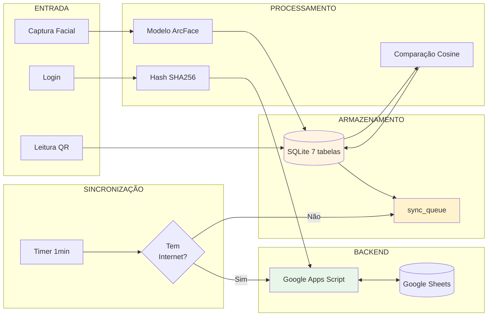

---

**Última atualização**: 2025-10-30
**Versão**: 1.0
**Autor**: Sistema Ellus - Documentação Técnica
