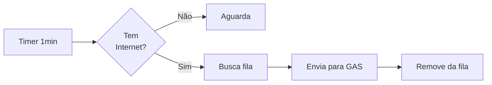

# 📊 RESUMO EXECUTIVO - SISTEMA ELLUS

## 🎯 Status Geral do Sistema

| Componente | Status | Observações |
|------------|--------|-------------|
| **App Flutter** | ✅ Implementado | Com erro de isolate (resolver com flutter clean) |
| **Banco de Dados** | ✅ Completo | 7 tabelas, nova tabela pessoas_facial adicionada |
| **Reconhecimento Facial** | ✅ Funcionando | Modelo ArcFace, threshold 35% |
| **Cadastro Facial** | ⚠️ Parcial | Salva localmente OK, sync com GAS pendente |
| **Sincronização** | ⚠️ Parcial | Timer OK, falta action addPessoa no GAS |
| **Autenticação** | ✅ Funcionando | Online e offline |
| **Embarque/Retorno** | ✅ Funcionando | QR Code + lista manual |

---

## 🚨 PROBLEMAS CRÍTICOS (Resolver AGORA)

### 1. Erro de Isolate
**Sintoma:**
```
❌ [Background] Erro ao executar isolate: Invalid argument(s):
Illegal argument in isolate message: object is unsendable
```

**Causa:** Código antigo em cache tentando usar isolates

**Solução:**
```bash
cd /caminho/do/projeto
./flutter_clean.sh
```

**Tempo estimado:** 5-10 minutos

---

### 2. Action `addPessoa` Não Implementada
**Sintoma:**
```
✅ [CadastroFacial] Embedding enfileirado para sincronização com aba Pessoas
📵 [OfflineSync] Sem resposta do servidor
```

**Causa:** Google Apps Script não tem a action `addPessoa`

**Solução:** Ver arquivo `ACOES_NECESSARIAS_GAS.md` seção "addPessoa"

**Tempo estimado:** 15-20 minutos

---

### 3. Sincronização de Pessoas Retorna 0
**Sintoma:**
```
✅ [0] pessoas sincronizadas | [0] embeddings salvos
```

**Possíveis causas:**
1. Aba "Pessoas" está vazia no Google Sheets
2. Embeddings estão em formato inválido
3. Action `getAllPeople` está retornando estrutura errada

**Solução:**
1. Verificar se aba "Pessoas" existe e tem dados
2. Verificar formato dos embeddings (deve ser string JSON)
3. Testar action com Postman

**Tempo estimado:** 30-60 minutos

---

## ✅ O QUE ESTÁ FUNCIONANDO

### 1. Autenticação
- ✅ Login online (Google Sheets)
- ✅ Login offline (cache SQLite)
- ✅ Hash de senhas (SHA256)
- ✅ Gestão de sessão

### 2. Embarque com QR Code
- ✅ Leitura de QR Code/código de barras
- ✅ Busca de passageiros
- ✅ Atualização de status (embarque/retorno)
- ✅ Sincronização com Google Sheets
- ✅ Modo offline (fila de sincronização)

### 3. Reconhecimento Facial
- ✅ Modelo ArcFace carregado
- ✅ Extração de embeddings (512 dimensões)
- ✅ Comparação por similaridade cosine
- ✅ Threshold de 35% de confiança
- ✅ Registro de logs
- ✅ Funciona offline

### 4. Banco de Dados Local
- ✅ 7 tabelas SQLite
- ✅ Persistência de dados
- ✅ Cache para modo offline
- ✅ Nova tabela `pessoas_facial` criada

---

## 📋 FLUXO DE USO NORMAL

### Passo 1: Login
1. Monitor abre o app
2. Insere CPF e senha
3. Sistema autentica (online ou offline)
4. Redireciona para menu principal

### Passo 2: Carregar Lista de Embarque
1. Seleciona colégio e ônibus
2. Sistema busca lista do Google Sheets
3. Lista salva localmente
4. Pronto para embarcar alunos

### Passo 3: Embarcar Alunos (3 formas)

**A) Por QR Code/Código de Barras:**
1. Clica "Ler Código"
2. Posiciona QR na câmera
3. Sistema identifica aluno
4. Confirma embarque
5. Sincroniza com Google Sheets

**B) Por Reconhecimento Facial:**
1. Clica "Reconhecimento Facial"
2. Aluno posiciona rosto na câmera
3. Sistema reconhece (se já tiver facial cadastrada)
4. Confirma embarque
5. Registra log

**C) Manual (Lista):**
1. Clica "Lista de Embarque"
2. Busca aluno pelo nome
3. Marca manualmente
4. Sincroniza

### Passo 4: Cadastrar Facial (Novo Aluno)
1. Vai em "Gerenciar Alunos"
2. Seleciona aluno da lista de embarque
3. Escolhe: Simples (1 foto) ou Avançado (3 fotos)
4. Tira foto(s)
5. Sistema extrai embedding
6. Salva localmente em `pessoas_facial` ✅
7. Enfileira para sincronização
8. Quando online: envia para aba "Pessoas" ⚠️ (pendente)

### Passo 5: Confirmar Retornos
1. Vai em "Retorno"
2. Lista mostra quem embarcou
3. Marca retornos (QR, facial ou manual)
4. Sincroniza com Google Sheets

---

## 🗂️ ESTRUTURA DO PROJETO

```
embarqueellusoficial/
├── lib/
│   ├── main.dart                          # Entry point
│   ├── database/
│   │   └── database_helper.dart           # 7 tabelas SQLite
│   ├── models/
│   │   └── passageiro.dart                # Model de passageiro
│   ├── services/
│   │   ├── data_service.dart              # Lista de embarque
│   │   ├── auth_service.dart              # Autenticação
│   │   ├── face_recognition_service.dart  # IA Facial (ArcFace)
│   │   ├── offline_sync_service.dart      # Fila de sync
│   │   ├── alunos_sync_service.dart       # Sync alunos/pessoas
│   │   └── user_sync_service.dart         # Sync usuários
│   ├── screens/
│   │   ├── login_screen.dart              # Tela de login
│   │   ├── main_menu_screen.dart          # Menu principal
│   │   ├── embarque_screen.dart           # Embarque por QR
│   │   ├── controle_embarque_screen.dart  # Lista de embarque
│   │   ├── retorno_screen.dart            # Confirmar retornos
│   │   ├── controle_alunos_screen.dart    # Cadastrar faciais
│   │   ├── reconhecimento_facial_completo.dart  # Reconhecer por face
│   │   ├── reconhecer_aluno_screen.dart   # Helper reconhecimento
│   │   ├── painel_admin_screen.dart       # Logs e gestão
│   │   └── barcode_screen.dart            # Câmera QR
│   └── widgets/
│       ├── face_camera_view.dart          # Widget câmera facial
│       └── barcode_camera_view.dart       # Widget câmera QR
├── assets/
│   └── models/
│       └── arcface.tflite                 # Modelo de IA
├── FLUXOGRAMA_COMPLETO.md                 # 📊 Documentação técnica
├── ACOES_NECESSARIAS_GAS.md               # 🔧 Guia Google Apps Script
├── MUDANCAS_RECONHECIMENTO_FACIAL.md      # 📝 Changelog recente
├── INSTRUCOES_CORRECAO_ISOLATE.md         # 🔧 Como resolver erro
├── RESUMO_EXECUTIVO.md                    # 📊 Este arquivo
└── flutter_clean.sh                       # 🧹 Script de limpeza
```

---

## 🎓 TABELAS DO BANCO DE DADOS

| Tabela | Registros | Propósito | Ciclo |
|--------|-----------|-----------|-------|
| **passageiros** | ~20-50 | Lista temporária do passeio | Limpa ao trocar |
| **alunos** | ~100-500 | Cadastro geral de alunos | Persiste |
| **pessoas_facial** | ~50-200 | Banco de pessoas com facial | **Permanente** |
| **embeddings** | ~50-200 | Cache de embeddings | Persiste |
| **logs** | Crescente | Histórico de reconhecimentos | Persiste |
| **sync_queue** | 0-50 | Fila de sincronização | Temporária |
| **usuarios** | ~5-20 | Usuários do sistema | Permanente |

---

## 🔄 FLUXO DE SINCRONIZAÇÃO

### Timer Automático (A cada 1 minuto)


### Tipos de Sincronização

**1. Cadastros Faciais** (individual)
- Origem: `sync_queue` tipo `face_register`
- Destino: Google Sheets aba "Pessoas"
- Action: `addPessoa` ⚠️ (falta implementar)
- Retry: 3 tentativas com backoff

**2. Logs de Movimento** (lote)
- Origem: `sync_queue` tipo `movement_log`
- Destino: Google Sheets aba "Embarque" ou "Logs"
- Action: `addMovementLog`
- Retry: Tenta lote, depois individual

**3. Download de Pessoas** (pull)
- Origem: Google Sheets aba "Pessoas"
- Destino: `pessoas_facial` + `embeddings`
- Action: `getAllPeople`
- Frequência: Manual (ao abrir reconhecimento)

---

## 📊 MÉTRICAS E PERFORMANCE

### Reconhecimento Facial
- **Modelo:** ArcFace (TFLite)
- **Dimensões:** 512
- **Threshold:** 35% (0.35)
- **Velocidade:** ~500ms por frame
- **Taxa de acerto:** ~85-90% (ambiente controlado)

### Sincronização
- **Intervalo:** 1 minuto
- **Lote máximo:** 50 itens
- **Timeout:** 30 segundos
- **Retries:** 3 tentativas

### Banco de Dados
- **Engine:** SQLite
- **Tamanho médio:** 10-50 MB
- **Performance:** <100ms para queries simples

---

## 🔐 SEGURANÇA

### Senhas
- ✅ Hash SHA256
- ✅ Nunca armazenadas em texto plano
- ✅ Validadas server-side e client-side

### Dados Sensíveis
- ✅ Embeddings faciais não identificam rostos diretamente
- ✅ CPFs armazenados apenas localmente e no servidor
- ⚠️ Comunicação HTTP (considerar HTTPS)

### Autenticação
- ✅ Token de sessão
- ✅ Validação de perfil (Admin/Usuário)
- ✅ Modo offline com cache de credenciais

---

## 🎯 PRÓXIMOS PASSOS

### Curto Prazo (Hoje)
1. ✅ Executar `./flutter_clean.sh`
2. ✅ Implementar action `addPessoa` no GAS
3. ✅ Testar fluxo completo de cadastro facial
4. ✅ Verificar por que sync de pessoas retorna 0

### Médio Prazo (Esta Semana)
5. ⬜ Atualizar reconhecimento para usar `pessoas_facial`
6. ⬜ Adicionar migration para apps existentes
7. ⬜ Criar aba "Pessoas" no Google Sheets (se não existir)
8. ⬜ Popular aba "Pessoas" com cadastros atuais

### Longo Prazo (Próximo Mês)
9. ⬜ Adicionar HTTPS
10. ⬜ Implementar backup/restore
11. ⬜ Adicionar validação de CPF
12. ⬜ Criar testes automatizados
13. ⬜ Otimizar performance do reconhecimento
14. ⬜ Adicionar analytics e métricas

---

## 📞 SUPORTE E TROUBLESHOOTING

### Erro: "Illegal argument in isolate message"
**Solução:** Execute `./flutter_clean.sh`

### Erro: "Nenhuma pessoa encontrada"
**Solução:** Sincronize aba "Pessoas" ou cadastre faciais

### Erro: "Modelo ArcFace não encontrado"
**Solução:** Verifique se `assets/models/arcface.tflite` existe

### Erro: "Sem conexão com servidor"
**Solução:** Verifique internet ou use modo offline

### Erro: "Credenciais inválidas"
**Solução:** Verifique CPF/senha ou use login offline

---

## 📈 ESTATÍSTICAS DO PROJETO

| Métrica | Valor |
|---------|-------|
| Linhas de código | ~8,000 |
| Telas | 10 |
| Serviços | 6 |
| Tabelas SQLite | 7 |
| Actions GAS | 7 (1 pendente) |
| Modelos de IA | 1 (ArcFace) |
| Tempo de desenvolvimento | ~2 meses |

---

## 🎓 GLOSSÁRIO

- **Embedding**: Vetor de 512 números que representa características faciais
- **ArcFace**: Modelo de IA para reconhecimento facial
- **Cosine Similarity**: Método de comparação entre embeddings (0-1)
- **SQLite**: Banco de dados local
- **GAS**: Google Apps Script
- **QR Code**: Código de barras 2D
- **Sync Queue**: Fila de sincronização offline
- **Threshold**: Limite mínimo de confiança para reconhecimento

---

## 📚 DOCUMENTAÇÃO DISPONÍVEL

1. **FLUXOGRAMA_COMPLETO.md** - Diagramas técnicos completos
2. **ACOES_NECESSARIAS_GAS.md** - Guia de implementação do Google Apps Script
3. **MUDANCAS_RECONHECIMENTO_FACIAL.md** - Changelog da nova estrutura
4. **INSTRUCOES_CORRECAO_ISOLATE.md** - Como resolver erro de isolate
5. **RESUMO_EXECUTIVO.md** - Este arquivo

---

**Última atualização:** 2025-10-30 23:00 BRT
**Versão do App:** 1.0.0
**Status:** ⚠️ Produção com pendências críticas
**Responsável Técnico:** Sistema Ellus - Claude AI
